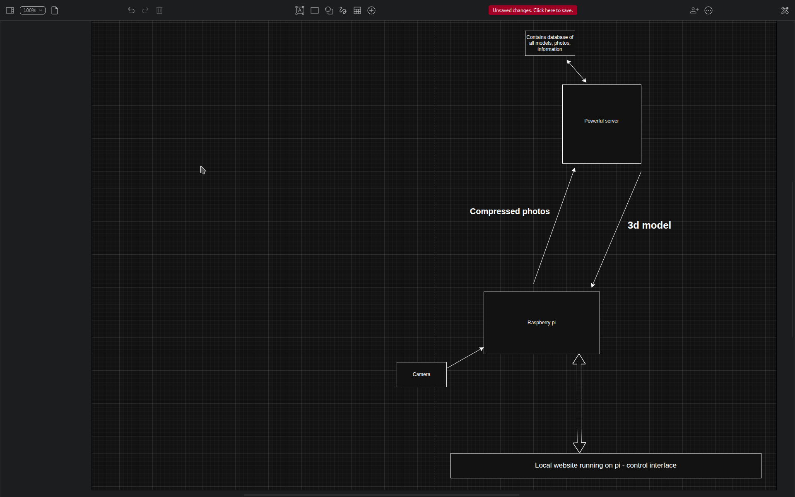

# Our FLL 2026 Innovation Project

## The Idea

The idea is to create a box in which archaeologists can put smaller artefacts and have them automatically categorised, weighted and 3D scanned.  
For the 3D scanning, we will be using a single camera and capturing the artefact from all angles.  
The photos will be sent to a more capable server which will use a third-party software to convert those images into a single 3D model.  
This will then be sent back to the Pi.

---
## Directory structure + tech stack
We will have 2 seperate devices that will be running diffrent code. One will be the server and one the pi, as described earlier and are represented as local, remote. In remote we have the server subdirectory, and the main application that will be constantly running is app.py.

### Remote
---
This is going to 
  - Receive zip files full of images from the pi
  - Store them in /uploads/ for temporary holding
  - Move them into a directory called /photogrammetry/
  - Call the photogrammetry script/function, that takes its input files from /photogrammety/ and outputs a 3d model to the folder /downloads/
  - We will have a /downloads enpoint open on the webserver that the pi can wget with correct authentication key.

---

### Local
---
This is going to
  - 
## Roles and To-Do

So, there’s a lot of work to be done.  
We’re gonna need a person to figure out the photogrammetry software,  
a person to work with databases (user auth + categorizing artefacts),  
and a person to design the frontend.

---

## Frontend dev - Ryan

**Capabilities**
- Good at HTML and CSS  
- JS basics

---

## Photogrammetry Person - Julian

**Capabilities**
- Good understanding of computer systems  
- Fully understands the tech stack  
- Automation with any language – I would recommend Python or Bash

---

## Backend Dev - Joyce

**Capabilities**
- Good understanding of computer systems  
- Fully understands the tech stack  
- SQL knowledge / experience  
- Flask knowledge / experience

--

## Overall co-ordinator - Julian

**Capabilities**
-Good at programming understand concepts, languages
-Im not bothered to write more cuz its just gonna be me

>>>>>>> b4d2a5f (Update files)
